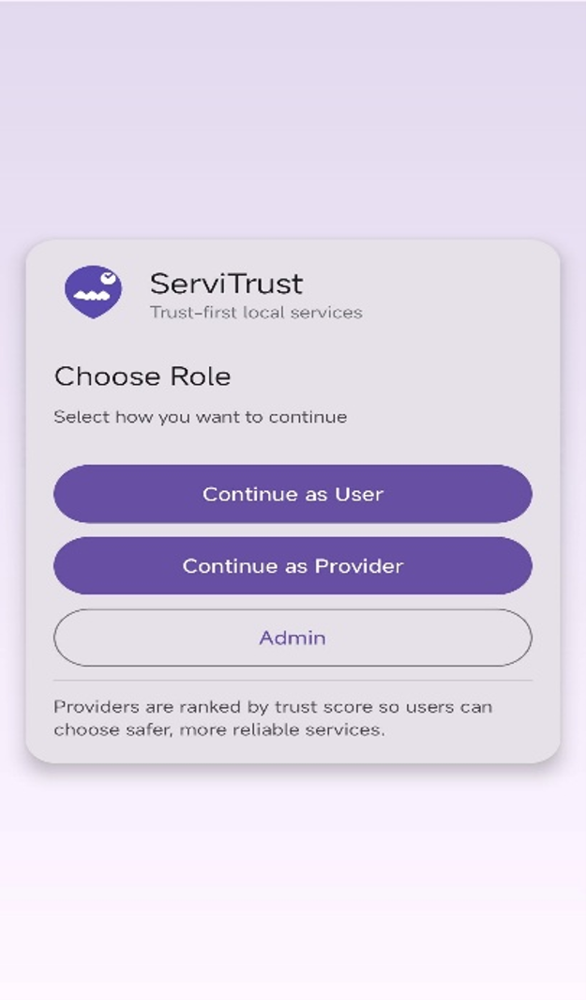
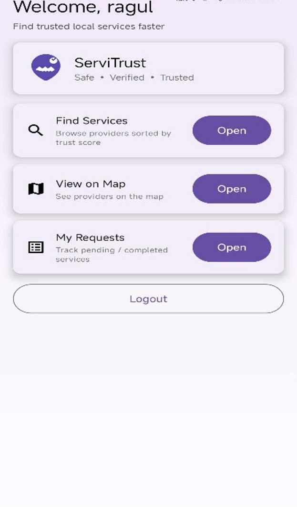
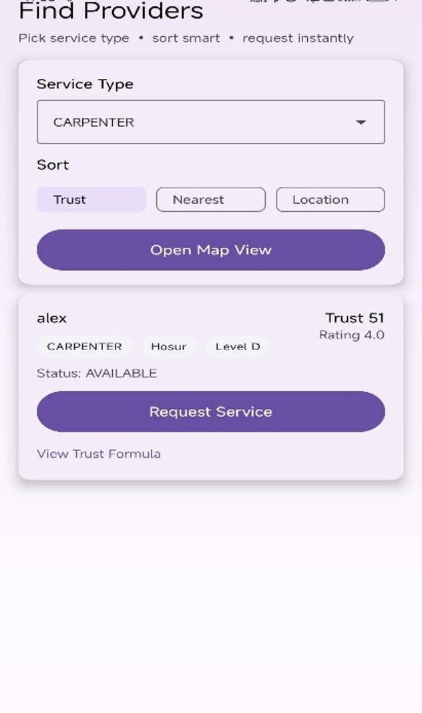
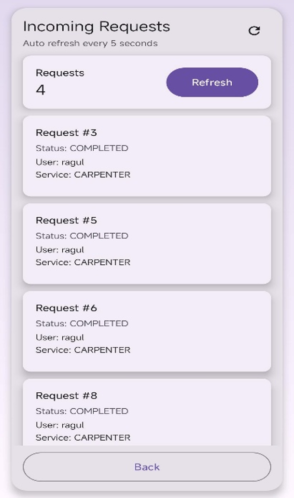

# ServiTrust – Reliable Local Services Through Trust Metrics

## 📖 Overview

ServiTrust is a trust-based local service marketplace application that connects customers with reliable service providers. The platform helps users discover, compare, and hire service professionals using a dynamic trust evaluation system based on service quality, customer feedback, and provider performance.

The system aims to improve transparency, reliability, and user confidence in local service platforms by enabling customers to make informed decisions when selecting service providers.

---

## 🎯 Objectives

- Develop a trust-based service discovery platform.
- Enable secure user and service provider management.
- Implement a dynamic trust score mechanism.
- Facilitate service request creation and tracking.
- Improve transparency through ratings and feedback.
- Provide a scalable and user-friendly service marketplace.

---

## ✨ Features

### User Management
- User Registration and Login
- Profile Management
- Role-Based Access Control

### Service Provider Management
- Provider Registration
- Service Category Management
- Availability Updates

### Service Discovery & Matching
- Search Services by Category
- Location-Based Provider Discovery
- Trust-Based Provider Ranking

### Service Request Management
- Create Service Requests
- Accept/Reject Requests
- Request Status Tracking

### Trust Score Management
- Dynamic Trust Score Calculation
- Performance-Based Evaluation
- Complaint and Feedback Analysis

### Rating & Feedback System
- Customer Reviews
- Provider Ratings
- Service Quality Assessment

---

## 🏗 System Architecture

The application follows a Three-Tier Architecture:

### Presentation Layer
- Android Application
- User Interface and Interaction

### Application Layer
- Spring Boot Backend
- Business Logic Processing
- REST API Services

### Data Layer
- MySQL Database
- Data Storage and Retrieval

---

## 🛠 Technologies Used

### Frontend
- Java
- Android Studio

### Backend
- Java
- Spring Boot
- Spring Data JPA
- REST APIs

### Database
- MySQL

### Tools
- Git
- GitHub
- Postman
- IntelliJ IDEA / Spring Tool Suite

### APIs
- Google Maps API
- RESTful Web Services

---

## 📂 Project Modules

### 1. User Management Module
Handles registration, login, authentication, and profile management.

### 2. Service Provider Management Module
Manages provider information, service categories, and availability.

### 3. Service Discovery & Matching Module
Allows users to find and compare service providers based on trust metrics.

### 4. Service Request Management Module
Handles service booking, request processing, and status updates.

### 5. Trust Score Management Module
Calculates provider trust scores using ratings, service history, and feedback.

### 6. Rating & Feedback Module
Collects customer feedback and updates provider reputation.

---

## 📊 Trust Score Calculation

The trust score is calculated dynamically using multiple performance factors:

Trust Score = (0.4 × Rating)
            + (0.3 × Completion Rate)
            + (0.2 × Response Score)
            + (0.1 × Experience Score)

This approach ensures that service providers are evaluated fairly based on their overall performance and reliability.

---

## 🚀 Future Enhancements

- AI-Based Service Recommendations
- Online Payment Gateway Integration
- Real-Time GPS Tracking
- In-App Chat System
- Push Notifications
- Fraud Detection Mechanism
- Analytics Dashboard

---

## 📸 Screenshots

Add application screenshots here.

### Login Screen

### Dashboard

### Service Providers

### Service Request

---

## 👨‍💻 Contributors

- Ragul K
- Project Team Members

---

## 📚 Keywords

Trust-Based Service Discovery, Android Application, Java, Spring Boot, REST API, MySQL, Trust Score, Service Matching, Local Service Marketplace, Customer Feedback System.

---

## 📄 License

This project is developed for academic and educational purposes.
